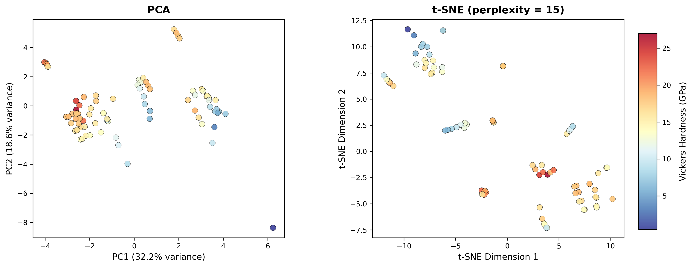
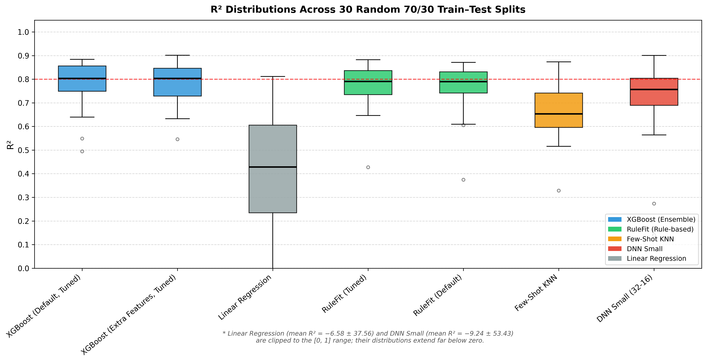
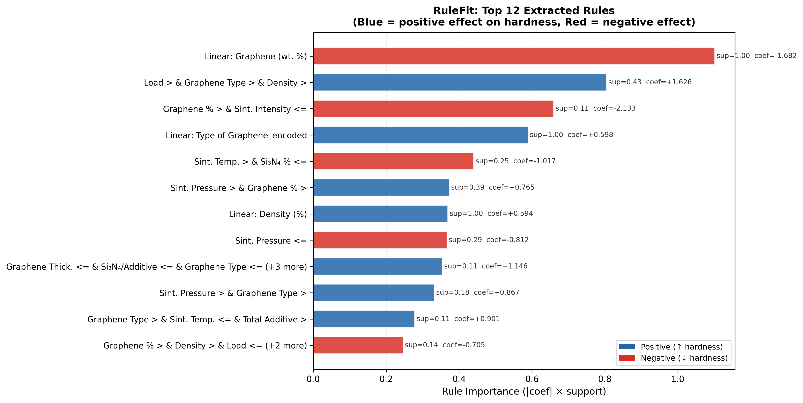
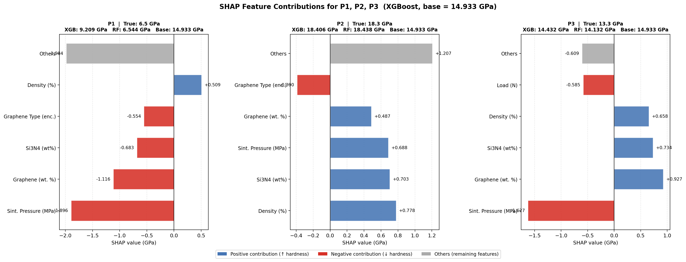
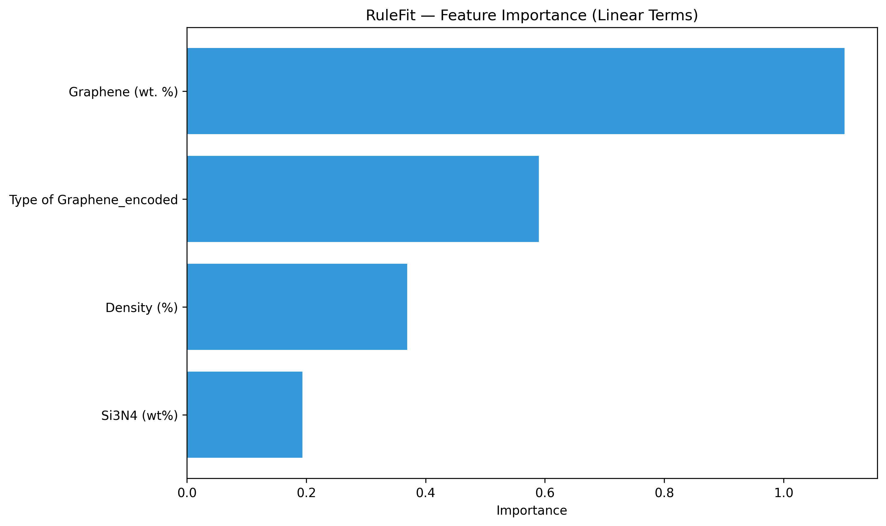
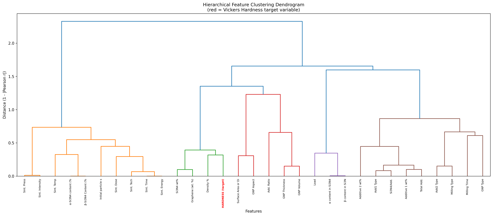

# Interpretable Machine Learning for Vickers Hardness Prediction of Graphene-Added Si₃N₄ Ceramics

[](https://www.python.org/)
[](LICENSE)
[](https://xgboost.readthedocs.io/)
[](https://shap.readthedocs.io/)
[](https://github.com/christophM/rulefit)

> **Paper:** *Interpretable Machine Learning Framework for Predicting Vickers Hardness of Graphene-Added Si₃N₄ Ceramics*

---

## Overview

This repository contains the full source code, dataset, and results for an interpretable machine learning (ML) study predicting the **Vickers hardness** of **graphene-reinforced Si₃N₄ ceramics**. The dataset comprises **82 experimentally characterised samples** sourced from the literature, covering a hardness range of **0.46–27.00 GPa**.

The central contribution is a **tuned RuleFit model** that matches the predictive accuracy of black-box models (XGBoost, DNN) while producing **human-readable, physically interpretable rules** — directly actionable for ceramic process design.

---

## Key Results

| Model | R² (70/30) | MAE (GPa) | RMSE (GPa) |
|---|---|---|---|
| **RuleFit (Tuned)** | **0.854** | **1.477** | **1.955** |
| XGBoost (Extra Features) | 0.835 | 1.599 | 2.074 |
| DNN Small (32-16) | 0.836 | 1.519 | 2.071 |
| XGBoost (Default) | 0.817 | 1.757 | 2.187 |
| RuleFit (Default) | 0.825 | 1.504 | 2.135 |
| ElasticNet | 0.636 | 2.338 | 3.081 |

> RuleFit (Tuned) gives the highest R² on the 70/30 split and stays stable at R² = 0.769 ± 0.089 across 30 random splits.
> Note: a single fixed hyperparameter configuration is used throughout. A leakage-free re-analysis
> ([`results/revision2/tables/nested_cv_30splits.csv`](results/revision2/tables/nested_cv_30splits.csv))
> re-selects the grid inside each training partition only, and finds the two procedures statistically
> indistinguishable across the 30 repeated partitions (paired ΔR² = −0.009, 95% CI [−0.048, +0.029],
> p = 0.62); on the fixed 70/30 split they differ by 0.028 in R². The repeated-split numbers are the
> basis for the comparative claims.

---

## Methodology

```
Raw Data (82 samples, 22 features)
         │
         ▼
Target Encoding (6 categorical variables)
         │
         ▼
Feature Engineering (+8 features → 30 total)
  • graphene_aspect_ratio    • sintering_energy
  • graphene_volume_proxy    • sintering_intensity
  • sintering_dose           • total_additive
  • additive_ratio           • si3n4_to_additive
         │
         ▼
Model Training & Evaluation
  ┌──────────────────────────────────────┐
  │  Fixed 80/20 split (Table 1)        │
  │  Fixed 70/30 split (Table 2)        │
  │  30-replicate stability (Table 3)   │
  │  One-tailed paired t-test (Table 4) │
  └──────────────────────────────────────┘
         │
         ▼
Interpretability Analysis
  • RuleFit rule extraction
  • SHAP (TreeExplainer on XGBoost)
  • LIME (LimeTabularExplainer)
  • SHAP waterfall for P1, P2, P3
```

---

## Repository Structure

```
├── data/
│   └── data.xlsx                      # Dataset (82 samples, 24 columns)
│
├── src/
│   ├── 01_train_and_evaluate.py       # Full training pipeline, all tables
│   ├── 02_pca_tsne.py                 # PCA and t-SNE visualisation
│   ├── 03_boxplot.py                  # R² distribution boxplot (30 splits)
│   ├── 04_shap_waterfall_and_rules.py # SHAP waterfall + RuleFit rule chart
│   └── 05_dendrogram_shap.py          # Feature dendrogram + SHAP summary
│
├── notebooks/
│   ├── vickers_hardness_prediction.ipynb  # Main analysis notebook
│   └── model_analysis.ipynb               # Extended model analysis
│
├── results/
│   ├── figures/                       # All generated figures (PNG)
│   │   ├── pca_tsne_combined.png
│   │   ├── boxplot_r2_distribution.png
│   │   ├── heatmap_correlation.png
│   │   ├── paper_dendrogram.png
│   │   ├── paper_shap_summary.png
│   │   ├── rulefit_feature_importance.png
│   │   ├── rulefit_rules_extracted.png
│   │   ├── shap_waterfall_p123.png
│   │   ├── fewshot_learning_curve.png
│   │   └── heatmap_model_performance.png
│   │
│   └── tables/                        # All result tables (CSV)
│       ├── paper_table1_80_20.csv
│       ├── paper_table2_70_30.csv
│       ├── paper_table3_30split.csv
│       ├── paper_table4_onetail_ttest.csv
│       ├── paper_30split_r2_raw.csv
│       └── rulefit_top_rules.csv
│
├── paper/
│   └── sn-article.tex                 # LaTeX source (Springer Nature)
│
├── requirements.txt
└── README.md
```

---

## Figures

### Data Structure
<p align="center">
  
</p>

*PCA and t-SNE projections coloured by Vickers hardness. The superseded version of this figure was produced by a
plotting script whose preprocessing had drifted from the modelling pipeline; the corrected version
([`results/revision2/figures/fig07_pca_tsne.png`](results/revision2/figures/fig07_pca_tsne.png)) gives
PC1 = 28.8% and PC2 = 17.5% (46.3% cumulative). Samples below 10 GPa and above 20 GPa separate partially,
but the 60 intermediate samples overlap extensively — hardness is not organised into compact 2-D clusters.*

---

### Model Stability (30 Random Splits)
<p align="center">
  
</p>

*R² distributions across 30 random 70/30 splits. XGBoost and RuleFit show narrow IQRs; Linear Regression and DNN exhibit extreme instability (clipped to [0,1] — their actual distributions extend far below zero).*

---

### RuleFit Extracted Rules
<p align="center">
  
</p>

*Top 12 rules from the tuned RuleFit model. Blue = hardness-increasing, Red = hardness-decreasing. The most important rule: high graphene content combined with insufficient sintering intensity strongly degrades hardness (coef = −2.133).*

---

### SHAP Waterfall Analysis
<p align="center">
  
</p>

*SHAP feature contributions for P1 (6.5 GPa), P2 (18.3 GPa) and P3 (15.4 GPa). Base value = 14.933 GPa.
These explanations come from the fixed-configuration interpretability XGBoost model
(n_estimators=300, max_depth=5, lr=0.05), which is not the tuned model of the benchmark tables.*

---

### Feature Importance & Clustering
<p float="left" align="center">
  
  
</p>

*Left: RuleFit linear-term importance. Four linear terms survive the sparse fit — graphene content
(coef −1.682), graphene type (+0.598), density (+0.594) and Si₃N₄ content (+0.277); sintering pressure
enters the model through Boolean rules rather than as a linear term. Right: dendrogram of the correlation
distance d = 1 − |r|. The revised version uses average linkage, which is the appropriate criterion for a
supplied distance matrix, and shows three feature families — sintering process parameters, material
composition, and graphene morphology.*

---

## Second Revision (August 2026)

The material under `results/revision2/` and `scripts/revision2/` was produced for the second
revision round of the manuscript. Nothing in the original analysis was re-run or replaced; these
files add measurements, corrected presentations of already-published results, and the scripts
that generate them.

**What was added**

| Item | Location |
|---|---|
| Eight figures redrawn at final printed size (vector PDF + 600 dpi PNG) | `results/revision2/figures/` |
| RuleFit rule set converted from standardised to physical units | `results/revision2/tables/rulefit_rules_physical_units.csv` |
| Leakage-free hyperparameter-selection re-analysis, per partition | `results/revision2/tables/nested_cv_30splits.csv` |
| Rebuilt Table 4 (effect sizes and confidence intervals) | `results/revision2/tables/table04_ttest.tex` |
| Scripts generating every figure and table above | `scripts/revision2/` |
| Package versions used for the revision | `requirements-revision2.txt` |

**Why the figures were redrawn.** The earlier figures were rendered on canvases 13–17 inches wide
and then scaled into the 131 mm single-column text block of the journal template, which reduced
every label by a factor of 1.8–3.9 and left the smallest type at roughly 3–4 pt. Each script now
draws at the final printed width and refuses to exceed it.

**Two corrections to exploratory figures.** The PCA/t-SNE script had drifted from the modelling
pipeline (label encoding instead of target encoding, reference label retained, different engineered
feature formulas), so ten of thirty-one columns reaching PCA were constant. The dendrogram was
computed with Ward linkage, which is defined for Euclidean geometry and is not appropriate for a
supplied correlation distance. Both are now generated from `scripts/revision2/data_pipeline.py`,
the same module the models use. Neither figure enters any model, split or reported metric.

**Reproducibility.** Under the versions pinned in `requirements-revision2.txt`, the XGBoost and
SHAP results reproduce the released values to four decimal places, and the figure scripts assert
this before plotting. RuleFit reproduces the released repeated-split mean R² only to within 0.003
(0.766 against 0.769), because the tree-ensemble and coordinate-descent implementations changed
between library releases.

**Running them**

```bash
pip install -r requirements-revision2.txt
cd scripts/revision2
python fig01_boxplot.py        # and fig02, fig03_06, fig04, fig05_08, fig07
python gen_table04.py          # rebuilds Table 4 from the analysis output
python nested_cv_check.py      # leakage-free re-analysis, ~15 min
```

Paths are resolved automatically from the repository layout by `scripts/revision2/paths.py`;
no path editing is required. Set `SI3N4_DATA`, `SI3N4_RESULTS` or `SI3N4_OUT` to override.

---

## Installation

```bash
# Clone the repository
git clone https://github.com/Yemresalcan/si3n4_graphene_rulefit.git
cd si3n4_graphene_rulefit

# Install dependencies
pip install -r requirements.txt
```

---

## Usage

### Run the full training pipeline
```bash
python src/01_train_and_evaluate.py
```
Outputs: all result CSVs and figures to `results/`

### Generate individual figures
```bash
python src/02_pca_tsne.py          # PCA + t-SNE
python src/03_boxplot.py           # Stability boxplot
python src/04_shap_waterfall_and_rules.py  # SHAP waterfall + rules
python src/05_dendrogram_shap.py   # Dendrogram + SHAP summary
```

### Run interactively
```bash
jupyter notebook notebooks/
```

---

## Dataset

| Property | Value |
|---|---|
| Samples | 82 |
| Original features | 22 |
| Engineered features | 8 |
| Total features | 30 |
| Target | Vickers hardness (GPa) |
| Target range | 0.46 – 27.00 GPa |
| Categorical variables | 6 (target-encoded) |

The dataset (`data/data.xlsx`) aggregates published experimental results for graphene-added Si₃N₄ ceramics, covering variations in graphene content, graphene type, sintering technique, temperature, pressure, time, and additive composition.

---

## Top Extracted RuleFit Rules

RuleFit is fitted on standardised inputs, so the thresholds stored in
`results/tables/rulefit_top_rules.csv` are z-scores of the training partition.
Inverting that scaling recovers the physical thresholds shown below; the complete
converted rule set is in
[`results/revision2/tables/rulefit_rules_physical_units.csv`](results/revision2/tables/rulefit_rules_physical_units.csv).

| Rule (physical units) | Coefficient | Support | Reading |
|---|---|---|---|
| Linear: Graphene (wt.%) | −1.682 | 1.00 | Globally, more graphene → lower hardness |
| Load > 7.4 N & Graphene type (enc.) > 14.2 & Density > 87.1 % | +1.626 | 0.43 | High load, favourable graphene type and a dense body → higher hardness |
| Graphene > 2.62 wt.% & Sintering intensity ≤ 6.25×10⁴ | −2.133 | 0.11 | Excess graphene under a low temperature–pressure product → severe hardness loss |
| Linear: Graphene type (encoded) | +0.598 | 1.00 | Graphene type globally shifts hardness |
| Sintering temperature > 1612 °C & Si₃N₄ ≤ 87.4 wt.% | −1.017 | 0.25 | High temperature with a low matrix fraction reduces hardness |
| Sintering pressure ≤ 27.5 MPa | −0.812 | 0.29 | Insufficient pressure penalises hardness on its own |
| Sintering pressure > 32.5 MPa & Graphene > 2 wt.% | +0.765 | 0.39 | Sufficient pressure offsets a high graphene loading |

---

## Requirements

```
pandas>=1.5
numpy>=1.23
scikit-learn>=1.2
xgboost>=1.7
shap>=0.44
rulefit>=0.3
lime>=0.2
matplotlib>=3.6
seaborn>=0.12
scipy>=1.9
openpyxl>=3.0
```

---

## Citation

If you use this code or dataset, please cite:

```bibtex
@article{salcan2026rulefit,
  title   = {Interpretable Machine Learning Framework for Predicting
             Vickers Hardness of Graphene-Added Si$_3$N$_4$ Ceramics},
  author  = {Salcan, Yunus Emre and others},
  journal = {Ceramics International},
  year    = {2026},
  note    = {Under review}
}
```

---

## License

This project is licensed under the MIT License — see the [LICENSE](LICENSE) file for details.
